# MSR-Assignment-3
Mining Software Repositories follow-up project to tackle external threat to MSR-Assignment-2 Project. 

An external validity addressing project as part of the MSR course at MSR course 2020/21 at UniKo, CS department, SoftLang Team 

Please cite the following paper if you intend to know more about the original research 

>  **Is Developer Sentiment Related to Software Bugs: An Exploratory Study on GitHub Commits**
  https://ieeexplore.ieee.org/document/9054801
  
> **DBLP Link:**
  https://dblp.org/rec/conf/wcre/HuqSS20.html

## Baseline:

### Requirements:

To run this project, you will need Python3+, pip and Git installed on the system. 

The reference links are provided below.

> **Python:**
  https://www.python.org/downloads/
  
> **pip:**
  https://pypi.org/project/pip/

> **Git:**
  https://git-scm.com/downloads
	
The necessary libraries and packages are specified in the **requirements.txt** file and will be validated in the below steps


## Process for acquiring the results: 

  * **Step 1:**
  Create a local directory in your machine where you want to pull the git project and clone the project by running the below command from cmd 
  (Make sure that you are in the newly created directory first!):
  
  	```git clone https://github.com/AjayTomar3342/MSR-Assignment-3```

  * **Step 2:**
  From cmd, move into the main folder of the cloned project
  
 	 ```cd MSR-Assignment-3```

  * **Step 3:**
  Execute the below commands to meet the pre-requisites to execute the code
  
  ```  	
      Unix/macOS
      python -m pip install -r requirements.txt

      Windows
      py -m pip install -r requirements.txt
  ```

  * **Step 4:**
  On satisfying the above requirements, move into the Process folder
  
	 ```cd Process```
  
  * **Step 5:**
  Execute the below commands to run the code from cmd
  
  ``` 
      Unix/macOS
      python msr_assignment_3.py

      Windows
      %run msr_assignment_3.py
  ```
  
  
  **NOTE:** 
  After each run of the code, the **Guava Repository**, **Zsh Repository** and **Power Shell Repository** Folder from the Process folder has to be deleted manually as for each run, GitHub API scrapes updated data and for successfull scraping, older data has to be deleted
  
  

## Alternative Process for acquiring the results(Backup):

For quick running of program, PyCharm use is suggested as it has good controls for removing manual steps to pull a repository and get it running.

Steps are:

  * **Step 1:**
  Make sure one is signed in on Github in Pycharm
  
  * **Step 2:**
  Open a new project
  
  * **Step 3:**
  Go to VCS Option on the Top Horizontal Options Bar
  
  * **Step 4:**
  Select Enable Version Control Integration Control inside VCS if not done already
  
  * **Step 5:**
  After checking the previous option on, select Checkout from Version Control and select Git
  
  * **Step 6:**
  In the new pop up window, include the link of the github repository you are trying to pull.
  Subsequently in the same pop up window, select an appropriate directory where the  project will be pulled.
  
  * **Step 7:**
  Select clone option to start the pulling process.
  
  * **Step 8:**
  Select option to start the pulled project in New Window or This window as per your personal preference.
  
  * **Step 9:**
  After this the project will be up and running and requirements.txt file will automatically install required libraries. Run the file msr_assignment_3.py from Process Folder to get the results

This is a quick process to start the testing of GitHub project taken from the Official Jet Brains Website. We have tried this with several PC’s and are confident that this will not give any errors.

> **Link to Above Process Video:**
  https://www.youtube.com/watch?v=ukbvdF5wqPQ&feature=emb_title


## Results:

Results are stored in an excel file inside Doc Folder named Results.xlsx. The information stored was taken from program console and was taken after the code was run on 10/3/2021.

Screenshots of Results are as follows:

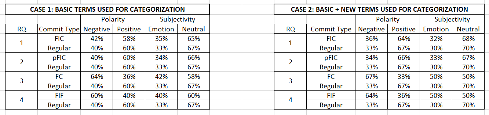 
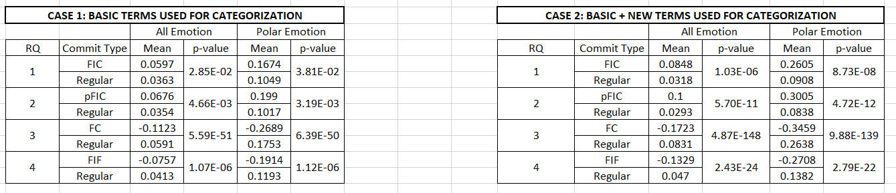 


## Data Flow

The scraped data flows as per the below methodology. Sample data flow of Guava Repository is depicted below. 

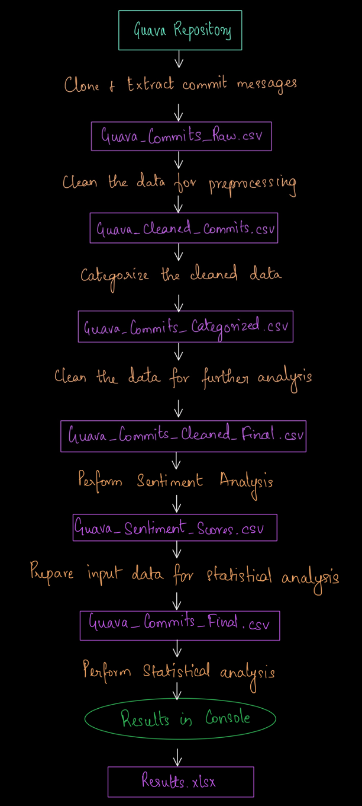 


## Validation: 

Input File (acquired after scraping GitHub Repository) is named as Guava_Commit_Raw.csv and an Output File (Results.xlsx) for viewing the input and output without execution. 

Check the generated output files in the below order to validate and understand the result

**1) Guava_Commits_Raw.csv** - The cloned repository commit messages - Input File

**2) Guava_Cleaned_Commits.csv** - The cleaned commit messages

**3) Guava_Commits_Categorized.csv** - The categorised messages

**4) Guava_Commits_Cleaned_Final.csv** - The clean data after categorisation

**5) Guava_Sentiment_Scores.csv** - The sentiment values for each message

**6) Guava_Commits_Final.csv** - The final output which will be used for statistical analysis including the categories and the sentiment values

**7) Results.xlsx** – The final statistical inference - Output File


## Data: 

Input data is the extracted messages from the cloned repository, the remaining files created as part of the program are all intermediate files.

### Final statistical results

The final results are printed as part of the console

**All Emotions - Rank Sum - Pvalue:**

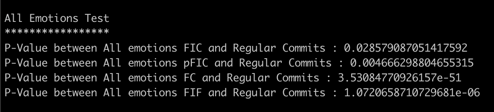

**All Emotions Pvalue - Bonferroni Correction:**

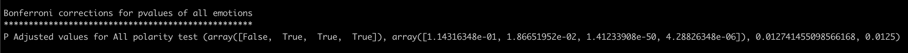

**Polar Emotions - Rank Sum - Pvalue:**

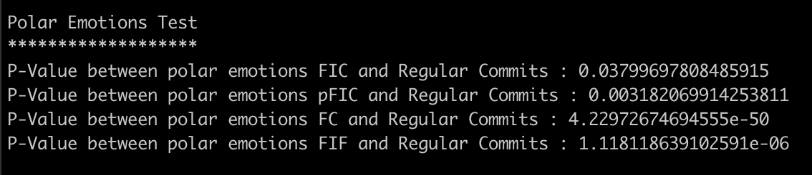

**Polar Emotions Pvalue - Bonferroni Correction:**

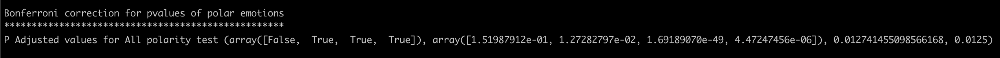

**Mean Values:**

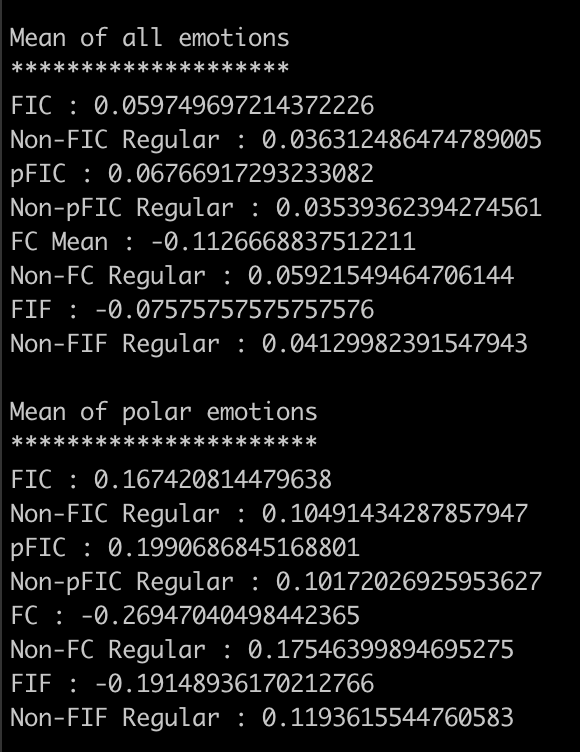

**Chi-Squared Statistics - Negative vs Positive:**

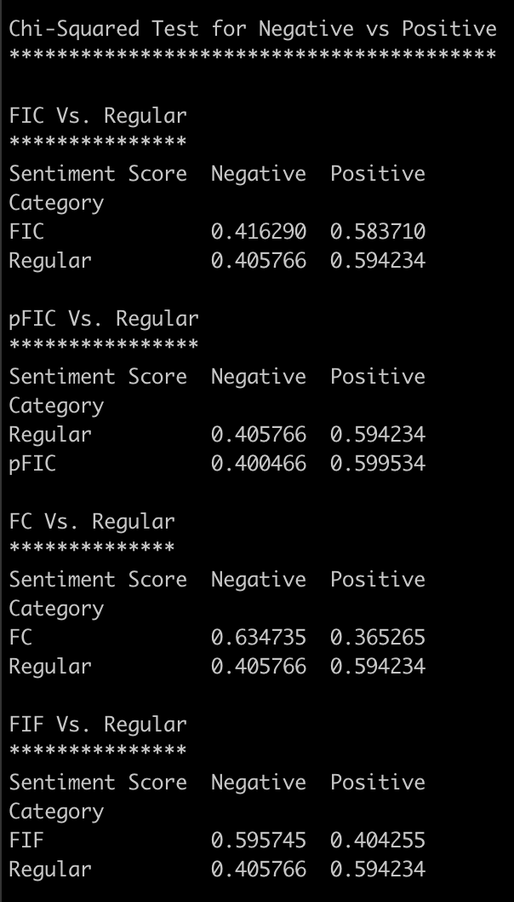

**Chi-Squared Statistics - Emotion vs Neutral:**

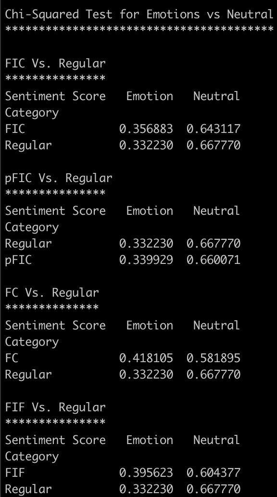


## Delta: 

### Process delta: 

* The original process followed in the research paper applies to 13 different huge GitHub repositories to collect a strong inference on the actual research. With respect to reproducing the research, we have applied the research steps on only 1 repository to avoid scalability issues. 

* The sentiment analysis performed in the original research paper involves Senti4SD tool but due to corrupted jar file issue within the Senti4SD code, we chose to alternatively go for NLTK Vader Sentiment analysis. In addition, NLTK Vader Sentiment Analysis sentiment scores for GitHub Commits (which were in the form of floating numbers ranging from [-1,1] were rounded up to -1/1(0 was pre-defined by the tool) as the output sentiment scores of GitHub Commits in original research process gave output in form of -1/0/1 for Negative, Neutral and Positive Sentiments for each GitHub Commit respectively.

* Mann-Whitney U Test (aka, Wilcoxon Rank Sum Test) has been implied on the data for statistical analysis despite the fact that Wilcoxon Rank Sum Test was used in the research paper since both are officially the same. Both are known to produce similar results but with minute differences.

### Data delta: 

* Due to no underlying piece of code in the research paper, we have developed the code from scratch using Python and its libraries to perform pre-processing, categorization, sentiment analysis and statistical analysis on the input data. 

* Among the multiple categories in which the data was split into, we have left out the non-FIF FC category as there was no clear understanding about this categorization in the paper and we were not ready to try out the categorization on the basis of our assumption.

* The p-values resulting from Bonferroni corrections is mostly 1 which means that the Mean values of the comparing data is almost same. This is inevitable as there is minor difference between the sentiment values among the different categories.

* The result in the research paper involves a combination of 13 huge repositories wherein we assume that the results that we got from our reproduction project is different since we considered only one medium sized repository for this task and that the repository might be biased.


## Experiment:

### Threat:
Original researchers analysed the sentiments of Commit messages of mostly Object-Oriented Languages (Java Based API’s/Servlet/Tools). This was done by categorizing the commit messages into four categories out of which the most important one (Fix Inducing Changes Category - Commit Messages to lead to broken code after Commit is done) was categorized if it contains terms such as “Fix”,” Bug”,” Patch”. This technique according to us makes the process and the results relatable to only a fraction of types of Programming Languages. The above-mentioned understanding comes after checking manually the type of languages of the repositories the original researchers used for testing their research paper research questions, it was found they were in majority Java-Based API's/Servlets/Tools. 

### Traces:
From the paper "Is Developer Sentiment Related to Software Bugs: An Exploratory Study on GitHub Commits" - the description of the repositories:

“Thirteen GitHub repositories are chosen based on popularity and inclusion in the GHTorrent dataset. The repositories are all mature with an average 9.7 years of project life and 148 releases. Furthermore, with an average of 170 contributors, the projects contain the collaboration necessary to analyse inter-developer communication. Due to being open source, the projects enforce communication via Commit messages as their teams are geographically dispersed. Extracting the Commits from the thirteen repositories yields the primary dataset. Categorizing the data according to the Commit Categorization section produces four sets of Commits.” 

Here, we see that the nature of the programming languages of the repositories researched is not discussed nor prioritized. Thus, we decided to conduct the same research on repositories dealing with different programming languages.

A snap of the list of the 13 repositories used in the paper:

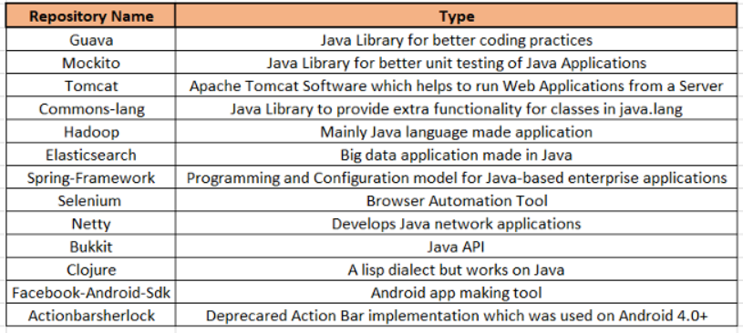

### Theory:
To remove the external validity threat above, we found multiple types of programming languages (More than the ones we added categorizing terms for in our threat to validity resolution process). We found various kinds of languages and some very different from each other and Java. 

Some examples are Array Languages, Assembly Languages, Command Line Interface Languages, Data-Flow Languages, Data-Oriented Languages, Functional Languages, Imperative Languages, Object-Oriented Languages, Procedural Languages. 

We planned to take multiple kinds of languages but due to unavailability of many types of languages as they are GitHub Repositories and if available, low amount of commit messages, we decided to consider only One type of Language. We took two languages **(Zsh and Power Shell)** from Command Line Languages Type, where the second one would be used to double check our results if we get results in positive direction. Additionally the initial language repository Julia (Used in MSR-Assignment-2), was also considered into checking overall impact of the new specialized terms we add in the expertment. 

For these languages, we will add some specific terms related to these languages which will increase the count of commits in FC Category. Please note that by visual inspection, it was seen that these newly added commits should already be added beforehand with the previous terms. Two category of terms were added for Zsh, Power Shell and Julia. These were:

**a.) Language Specific Terms:** These terms are exclusive to the specific languages/language types as these are supposed to add FC Commits for the specific language/language type. For Zsh, these terms were **Typo** and **Missing**. For Power Shell, these were **Cat** and **Typo**. For Julia, the term used was **Avoid**.

**b.) General Terms:** These terms are supposed to add desired commits into FC's for all type of languages(Language Types mentioned above). Some general terms used were **Tweak**, **Correct**, **Error** and **Fail**. 

Please note that the categorization of FC's using Language Specific Terms wasn't exclusive to their respective Language Repository only. To explain, all terms were used for all languages for categorization. Ideally, there should be specific categorization for some commits respective to some languages but, as per the takeaways from Consulation Session and Assignment requirements, this assignment didn't require a full-fledged resolution of a validity threat. Due to this reason, the project was scaled down. 


### Feasibility:

As mentioned above, personalized coding for each different GitHub repository wasn't done in this project. It could have minimal impact as this just adds a bit more commits from Language Repositories for which the categorizing terms weren't planned. 
Additionally, the project was scaled down to one language type with two languages so that we can **double check** our results impact while not focusing on too many language types at the same time. Ideally to cover multiple language types, it's better to have professionals working with the different type of languages while finalizing different terms for different language type. But the fulfillment of such a requirement is easier said than done. 

### Implementation:

Implementation of the project consisted of two main ideas primarily:

a.) Deciding Language Specific and General terms based on Language Type.

b.) Adding the terms in the rudimentary if-else clause present on line no. 85 of the msr_assignment_3.py file. 

The first step took majority(90%) of the time, and is definitely the essential step of this process. 

Collectively, both of these add up to categorize more desired commits into FC Category and thus addressing our threat to external validity. 

### Results:

#### Intermediate Results:

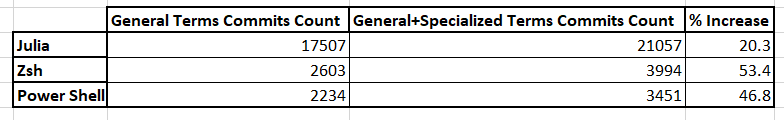

As described in the above image, at least 20% increase of commits in FC Commits have been observed.
Zsh and Power Shell had an average increase of 50% once specialized categorization terms have been added to initial General Terms. 

In case of Julia, not much increase has been observed as the original categorizing terms "Bug", "Fix" and "Patch" already were covering most of the FC Commits in the repository. So, perhaps the original categorizing terms are good enough for Object Oriented Languages. 


#### Final Results:


Results are also present in Data/Results.xlsx. Conclusions are divided into two categories below:

##### Positive Conclusions:

1.) FIF are those commits which were supposed to fix a bug but instead added another. These show highly negative mean value in both All and Polar Emotions which show that Sentiment Analysis are negative while committing commits which lead to a bug. In comparison, when we used only Basic Terms(Fix, Bug, Patch), FIF show less negative mean, but when we use specialized terms, overall we get more negative FIF's which prove that new terms categorized more negative emotion commits which weren't being categorized earlier. 		

2.) Comparatively, we get more positive pFIC in both All and Polar Emotions in New Terms case. This is in accordance with our hypothesis of using specialized terms for categorization of commits as pFIC should have more positive emotion commits. 																				

3.) Similar to FIF, FC's are more negative in the new terms case indicating that the new terms added more commits which have negative emotion in their background. This is a positive impact we can see in categorization procedure due to adding specializing terms													

4.) Regular Commits should have mean of emotions close to 0 as much as possible as theoretically it should have neutral emotions which our VADER sentiment analysis gives score of 0. Comparatively, Regular Commits in comparison with FIC and pFIC are close to 0 then when we used Basic Terms									

5.) In comparison, FC's categorized from new terms are more negative(By 3%) proving some impact of new terms into adding negative emotion commits in FC Category. In terms of Emotion and Neutral percentages, more emotion commits have been added by new terms with 20% increase.											

6.) Negative emotion commits have reduced considerably(by 7%). The reduction of this % can be accounted with the addition to FC's negative commits probably			
																
7.) Positive commits proprotion have increased in pFIC's which indicate affirmation to our hypothesis. Emotional commits have also reduced confirming to our hypothesis		

8.) FIF negative emotion proportion increased a good amount by 4%. Emotional commits increased significantly in FIF. Both of these facts reaffirm our hypothesis as FIF should be more negative and emotional.																				
																					
##### Negative Conclusions: 

1.) When we get Regular Commits in comparison with FC and FIF, mean of new terms Regular Commits is far from 0 when compared to mean in case of Basic Terms. This is the only comparison where our New Terms do not perform in according with our hypothesis.														

2.) In FIC's, contrary to our hypothesis negative polarity commits have reduced drastically. Also, emotion commits are reduced too.																					

### Process:

There is an additional step to get results for comparison after adding new terms to the scenario. First run the program as it is as mentioned in the Baseline/Process above. Then delete all the Scraped Repositories data and **uncomment the terms present from line 95-98(In case of using Alternate method for executing the project)*** and add them into if-else clause. During first run, results without new terms will appear in console, during second run(after adding new terms), improved results will appear as mentioned above. 

